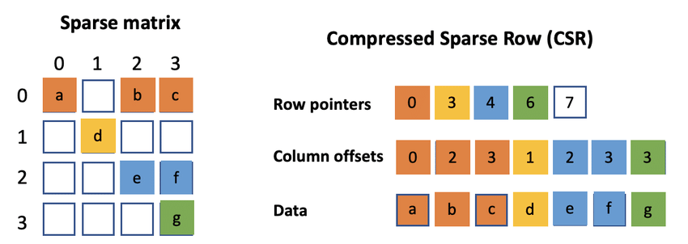

# Compressed Sparse Row Matrix Library (CSR) - C++

This library implements a **Compressed Sparse Row (CSR) matrix** in C++, optimizing storage and operations on sparse matrices. The library also implements conversion of matrices into **row- reduced echelon form using gaussian elimination algorithms** The library supports addition, subtraction, multiplication, and elementary row operations of matrices.

## What is CSR?

The **Compressed Sparse Row** or **Yale** matrix format is useful for large matrices common in data analysis and machine learning. For matrices with sparsely distributed non-zero elements, the CSR format utilizes much less memory overhead than a standard matrix data structure. The CSR format stores the locations and values of non-zero elements within the matrix, therefore implying the location of all zero elements.

## Features

- **Efficient Storage**: Stores only non-zero elements.
- **Matrix Operations**: Add, subtract, and multiply matrices.
- **Elementary Row Operations**: Swap, scale, and add rows.
- **Row Reduction**: Perform Gaussian elimination for solving linear systems.

## How It Works

The CSR format uses:
1. **`values[]`**: Stores non-zero matrix values.
2. **`col_ind[]`**: Column indices corresponding to `values[]`.
3. **`row_ptr[]`**: Pointers to the start of each row.

### Matrix Operations

- **Addition/Subtraction**: Efficient operations across matching non-zero elements.
- **Multiplication**: Optimized for sparse data.
- **Elementary Row Operations**: Easily manipulate rows for the row reduction algorithm.

## Benefits

- **Memory Efficient**: Ideal for sparse matrices.
- **Fast Access**: Efficient row-based modifications.
- **Performance**: Minimizes operations, improving performance.

